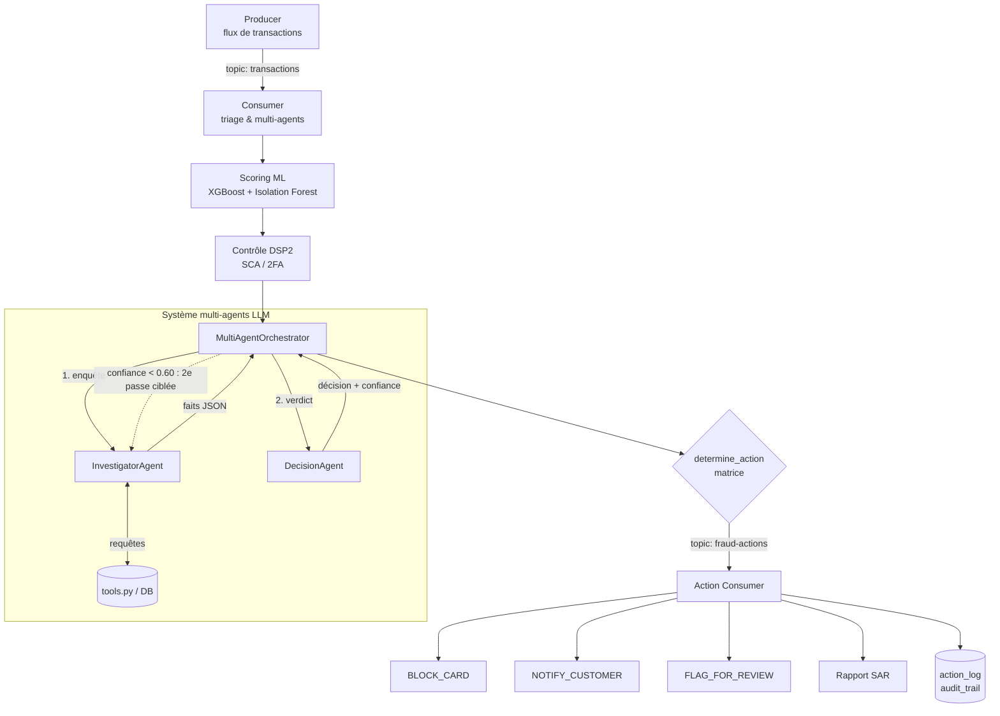

# 🛡️ Détection et Réponse Autonome aux Fraudes Bancaires par Agents IA

> Plateforme de surveillance transactionnelle en temps réel combinant **Machine Learning**, **agents LLM collaboratifs** et **remédiation automatisée**, conforme aux exigences **DSP2**, **RGPD** et **Tracfin/ACPR**.


---

## 📑 Sommaire

- [Aperçu](#-aperçu)
- [Architecture](#-architecture)
- [Fonctionnalités clés](#-fonctionnalités-clés)
- [Stack technique](#-stack-technique)
- [Démarrage rapide](#-démarrage-rapide)
- [Configuration](#-configuration)
- [Structure du projet](#-structure-du-projet)
- [Conformité et sécurité](#-conformité-et-sécurité)
- [Équipe](#-équipe)

---

## 🎯 Aperçu

Chaque transaction bancaire traverse un pipeline en quatre temps :

1. **Scoring ML** : XGBoost (supervisé) et Isolation Forest (non supervisé) évaluent le risque.
2. **Contrôle DSP2** : vérification de l'authentification forte (SCA/2FA) et des exemptions.
3. **Analyse multi-agents LLM** : un enquêteur collecte les faits, un décideur rend un verdict motivé.
4. **Action automatique** : blocage, notification ou escalade, avec traçabilité complète.

Le système est **explicable** : chaque décision est accompagnée d'un score de confiance, d'une justification textuelle et d'une piste d'audit horodatée.

---

## 🏛️ Architecture



---

## 🧩 Fonctionnalités clés

### 1. 🤖 Système multi-agents spécialisés (`LLM/agents/`)

| Agent | Rôle | Particularité |
|---|---|---|
| **InvestigatorAgent** | Enquête factuelle autonome | Interroge la base via `LLM/tools.py` (historique, profil de risque). Produit `anomalies_detected`, `risk_factors`, `mitigating_factors`, `factual_context`. **Aucun parti pris décisionnel.** |
| **DecisionAgent** | Juge impartial | **Pas d'accès direct à la base.** Croise scores ML, rapport de l'enquêteur et statut DSP2. Rend un verdict avec confiance (0.0 à 1.0), justification et action recommandée. |
| **MultiAgentOrchestrator** | Supervision | Coordonne les échanges, déclenche une **2ᵉ passe d'enquête ciblée** si `confiance < 0.60`, journalise chaque étape. |

> 💡 **Séparation des responsabilités** : celui qui enquête ne décide pas, et celui qui décide n'accède pas aux données brutes. Cela réduit les biais et améliore l'auditabilité.

### 2. ⚡ Réponses automatisées en temps réel (`kafka_pipeline/`, `compliance/actions.py`)

Les actions sont publiées sur le topic Kafka dédié `fraud-actions`, puis exécutées par `action_consumer.py` et historisées dans `action_log`.

| Verdict | Confiance | Action | Effet |
|---|---|---|---|
| `fraude` | ≥ 0.85 | `BLOCK_CARD` | Blocage immédiat de la carte, alerte Core Banking, génération d'un SAR |
| `fraude` | 0.60 à 0.85 | `NOTIFY_CUSTOMER` | SMS/Push instantané pour confirmation par le client |
| `incertain` | ou < 0.60 | `FLAG_FOR_REVIEW` | Escalade prioritaire vers le desk analystes fraude (L2) |
| `legitime` | toute | `ALLOW` | Autorisation sans restriction |

### 3. 📜 Conformité réglementaire, traçabilité et RGPD (`compliance/`, `db.py`)

- **Rapports SAR (ACPR / Tracfin)** : génération automatique (JSON + Markdown) pour toute fraude confirmée.
- **DSP2 / SCA** : contrôle de l'authentification forte selon les règles et exemptions de la directive.
- **RGPD** : hash irréversible des identifiants clients (`CUST_HASH_...`) et masquage PCI-DSS des cartes (`**** **** **** 1234`).
- **Piste d'audit** : traçabilité horodatée de bout en bout (`ML_SCORING`, `INVESTIGATION`, `DECISION`, `ACTION_DISPATCHED`, `ACTION_EXECUTED`, `SAR_GENERATED`).

---

## 🧰 Stack technique

| Couche | Technologies |
|---|---|
| Machine Learning | XGBoost, Isolation Forest (scikit-learn) |
| Agents LLM | Architecture ReAct, factory multi-fournisseurs : Ollama, Mistral, OpenAI, Anthropic |
| Streaming | Apache Kafka (mode KRaft), Kafka UI |
| Persistance | PostgreSQL |
| Déploiement | Docker, Docker Compose |
| Langage | Python |

---

## 🚀 Démarrage rapide

### Prérequis

- Docker et Docker Compose
- Python 3.10+ (pour un lancement hors Docker)
- Une clé API pour le fournisseur LLM choisi, ou un modèle local via Ollama

### 1. Cloner le dépôt

```bash
git clone https://github.com/nouhailasalahmi/intelligent-fraud-detection.git
cd intelligent-fraud-detection
```

### 2. Configurer l'environnement

```bash
cp .env.example .env
# puis renseigner vos valeurs dans .env (voir section Configuration)
```

### 3. Lancer toute la plateforme

```bash
docker-compose up --build
```

### 4. Vérifier que tout tourne

| Service | Rôle | Accès |
|---|---|---|
| `data_base` | PostgreSQL : transactions, `action_log`, `audit_trail`, statuts cartes | port PostgreSQL |
| `broker` | Apache Kafka (KRaft) | port Kafka |
| `kafka-ui` | Interface web pour inspecter les topics | http://localhost:8080 |
| `consumer` | Scoring ML, inférence multi-agents, dispatch des actions | logs du conteneur |
| `action_consumer` | Exécution des actions et génération des SAR | logs du conteneur |
| `producer` | Simulateur de transactions en temps réel | logs du conteneur |

Suivre le flux en direct :

```bash
docker-compose logs -f consumer action_consumer
```

### Installation locale (sans Docker)

```bash
python -m venv .venv
source .venv/bin/activate        # Windows : .venv\Scripts\activate
pip install -r requirements.txt
```

---

## ⚙️ Configuration

Les paramètres sont centralisés dans `config.py` (seuils de décision, connexion base, Kafka) et les secrets dans un fichier `.env` **jamais versionné**.

Exemple de `.env.example` (adapter les noms aux variables réellement lues par `config.py`) :

```env
# Fournisseur LLM : ollama | mistral | openai | anthropic
LLM_PROVIDER=ollama
LLM_API_KEY=your_key_here

# Base de données
POSTGRES_USER=your_user
POSTGRES_PASSWORD=your_password
POSTGRES_DB=fraud_db
```

> ⚠️ Ne commitez jamais `.env` ni vos clés API. Vérifiez qu'il figure dans `.gitignore`.

---

## 📁 Structure du projet

```
├── Dockerfile
├── docker-compose.yml
├── requirements.txt
├── config.py                     # Configuration centralisée et seuils
├── db.py                         # PostgreSQL (transactions, audit_trail, action_log)
│
├── compliance/                   # Conformité bancaire et réglementaire
│   ├── actions.py                # Matrice décision -> action
│   ├── dsp2.py                   # Vérification SCA / exemptions DSP2
│   ├── rgpd.py                   # Pseudonymisation et masquage PCI-DSS
│   └── sar_generator.py          # Générateur de rapports SAR / Tracfin
│
├── LLM/                          # Moteur agentique
│   ├── factory.py                # Factory LLM (Ollama, Mistral, OpenAI, Anthropic)
│   ├── tools.py                  # Outils d'investigation de données
│   ├── agent.py                  # Agent ReAct legacy
│   ├── analyzer.py               # Analyseur LLM classique
│   └── agents/                   # Architecture multi-agents
│       ├── investigator_agent.py # Collecte des faits
│       ├── decision_agent.py     # Arbitrage et verdict
│       └── orchestrator.py       # Orchestration et supervision
│
├── ML/                           # Modèles de détection
│   ├── fraud_detector.py         # Pipeline XGBoost + Isolation Forest
│   └── models/                   # Artefacts des modèles entraînés
│
├── kafka_pipeline/               # Streaming temps réel
│   ├── producer.py               # Générateur de transactions
│   ├── consumer.py               # Ingestion, ML, DSP2, multi-agents
│   └── action_consumer.py        # Exécution des actions et SAR
│
└── entities/                     # Modèles de données
    ├── customers.py
    └── transactions.py
```

> Les dossiers `tests/` et `reports/` (rapports SAR générés à l'exécution) ne sont pas versionnés.

---

## 🔐 Conformité et sécurité

- Pseudonymisation des identifiants clients avant tout traitement par les agents LLM.
- Masquage des numéros de carte conforme PCI-DSS.
- Agent décideur isolé de la base de données (principe du moindre privilège).
- Piste d'audit complète pour chaque décision automatisée, exploitable lors d'un contrôle.

