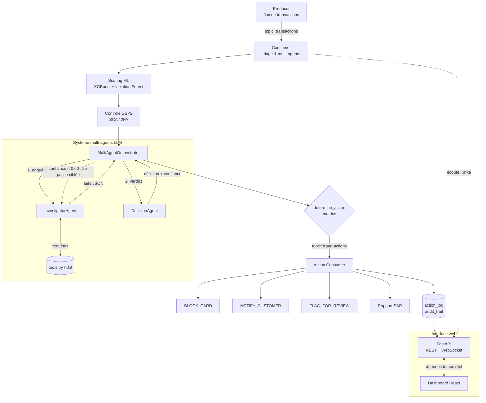

# 🛡️ Détection et Réponse Autonome aux Fraudes Bancaires par Agents IA

> Plateforme de surveillance transactionnelle en temps réel combinant **Machine Learning**, **agents LLM collaboratifs**, **remédiation automatisée** et un **dashboard web temps réel**, conforme aux exigences **DSP2**, **RGPD** et **Tracfin/ACPR**.


---

## 📑 Sommaire

- [Aperçu](#-aperçu)
- [Architecture](#-architecture)
- [Fonctionnalités clés](#-fonctionnalités-clés)
- [Stack technique](#-stack-technique)
- [Démarrage rapide](#-démarrage-rapide)
- [Configuration](#-configuration)
- [Génération des données synthétiques](#-génération-des-données-synthétiques)
- [Structure du projet](#-structure-du-projet)
- [Conformité et sécurité](#-conformité-et-sécurité)

---

## 🎯 Aperçu

Chaque transaction bancaire traverse un pipeline en cinq temps :

1. **Scoring ML** : XGBoost (supervisé) et Isolation Forest (non supervisé) évaluent le risque.
2. **Contrôle DSP2** : vérification de l'authentification forte (SCA/2FA) et des exemptions.
3. **Analyse multi-agents LLM** : un enquêteur collecte les faits, un décideur rend un verdict motivé.
4. **Action automatique** : blocage, notification ou escalade, avec traçabilité complète.
5. **Restitution temps réel** : l'API expose les alertes, transactions et rapports, consommés par un dashboard web via REST et WebSocket.

Le système est **explicable** : chaque décision est accompagnée d'un score de confiance, d'une justification textuelle et d'une piste d'audit horodatée, visible directement depuis l'interface web.

---

## 🏛️ Architecture


```mermaid
flowchart TD
    P[Producer<br/>flux de transactions] -->|topic: transactions| C[Consumer<br/>triage & multi-agents]
    C --> ML[Scoring ML<br/>XGBoost + Isolation Forest]
    ML --> D2[Contrôle DSP2<br/>SCA / 2FA]
    D2 --> O

    subgraph MA [Système multi-agents LLM]
        direction TB
        O[MultiAgentOrchestrator]
        I[InvestigatorAgent]
        DEC[DecisionAgent]
        T[(tools.py / DB)]
        O -->|1. enquête| I
        I <-->|requêtes| T
        I -->|faits JSON| O
        O -->|2. verdict| DEC
        DEC -->|décision + confiance| O
        O -.->|confiance < 0.60 : 2e passe ciblée| I
    end

    O --> M{determine_action<br/>matrice}
    M -->|topic: fraud-actions| AC[Action Consumer]
    AC --> A1[BLOCK_CARD]
    AC --> A2[NOTIFY_CUSTOMER]
    AC --> A3[FLAG_FOR_REVIEW]
    AC --> A4[Rapport SAR]
    AC --> LOG[(action_log<br/>audit_trail)]

    subgraph WEB [Interface web]
        direction LR
        API[FastAPI<br/>REST + WebSocket]
        FE[Dashboard React]
        API <-->|données temps réel| FE
    end

    LOG --> API
    C -.->|écoute Kafka| API
```

---

## 🧩 Fonctionnalités clés

### 1. 🤖 Système multi-agents spécialisés (`LLM/agents/`)

| Agent | Rôle | Particularité |
|---|---|---|
| **InvestigatorAgent** | Enquête factuelle autonome | Interroge la base via `LLM/tools.py` (historique, profil de risque). Produit `anomalies_detected`, `risk_factors`, `mitigating_factors`, `factual_context`. **Aucun parti pris décisionnel.** |
| **DecisionAgent** | Juge impartial | **Pas d'accès direct à la base.** Croise scores ML, rapport de l'enquêteur et statut DSP2. Rend un verdict avec confiance (0.0 à 1.0), justification et action recommandée. |
| **MultiAgentOrchestrator** | Supervision | Coordonne les échanges, déclenche une **2ᵉ passe d'enquête ciblée** si `confiance < 0.60`, journalise chaque étape. |

> 💡 **Séparation des responsabilités** : celui qui enquête ne décide pas, et celui qui décide n'accède pas aux données brutes. Cela réduit les biais et améliore l'auditabilité.

### 2. ⚡ Réponses automatisées en temps réel (`kafka_pipeline/`, `compliance/actions.py`)

Les actions sont publiées sur le topic Kafka dédié `fraud-actions`, puis exécutées par `action_consumer.py` et historisées dans `action_log`.

| Verdict | Confiance | Action | Effet |
|---|---|---|---|
| `fraude` | ≥ 0.85 | `BLOCK_CARD` | Blocage immédiat de la carte, alerte Core Banking, génération d'un SAR |
| `fraude` | 0.60 à 0.85 | `NOTIFY_CUSTOMER` | SMS/Push instantané pour confirmation par le client |
| `incertain` | ou < 0.60 | `FLAG_FOR_REVIEW` | Escalade prioritaire vers le desk analystes fraude (L2) |
| `legitime` | toute | `ALLOW` | Autorisation sans restriction |

### 3. 🌐 API & dashboard temps réel (`api/`, `frontend/`)

- **API REST + WebSocket** (FastAPI, `api/`) : authentification, gestion des transactions, alertes, rapports et statistiques du dashboard, avec écoute Kafka en arrière-plan pour pousser les mises à jour en direct.
- **Dashboard web** (React + TypeScript, `frontend/`) : visualisation des alertes, du statut des transactions et des rapports SAR, mise à jour en temps réel via WebSocket.
- Documentation interactive générée automatiquement (Swagger/OpenAPI).

### 4. 📜 Conformité réglementaire, traçabilité et RGPD (`compliance/`, `db.py`)

- **Rapports SAR (ACPR / Tracfin)** : génération automatique (JSON + Markdown) pour toute fraude confirmée.
- **DSP2 / SCA** : contrôle de l'authentification forte selon les règles et exemptions de la directive.
- **RGPD** : hash irréversible des identifiants clients (`CUST_HASH_...`) et masquage PCI-DSS des cartes (`**** **** **** 1234`).
- **Piste d'audit** : traçabilité horodatée de bout en bout (`ML_SCORING`, `INVESTIGATION`, `DECISION`, `ACTION_DISPATCHED`, `ACTION_EXECUTED`, `SAR_GENERATED`).

---

## 🧰 Stack technique

| Couche | Technologies |
|---|---|
| Machine Learning | XGBoost, Isolation Forest (scikit-learn) |
| Agents LLM | Architecture ReAct, factory multi-fournisseurs : Ollama, Mistral, OpenAI, Anthropic |
| Streaming | Apache Kafka (mode KRaft), Kafka UI |
| Persistance | PostgreSQL |
| API | FastAPI (REST + WebSocket), authentification JWT |
| Interface web | React 19, TypeScript, Vite, Tailwind CSS, Recharts |
| Déploiement | Docker, Docker Compose |
| Langage | Python |

---

## 🚀 Démarrage rapide

### Prérequis

- Docker et Docker Compose
- Python 3.10+ (pour générer les données et entraîner les modèles, ou pour un lancement hors Docker)
- Node.js 18+ (pour lancer le frontend hors Docker)
- Une clé API pour le fournisseur LLM choisi, ou un modèle local via Ollama

### 1. Cloner le dépôt

```bash
git clone https://github.com/nouhailasalahmi/intelligent-fraud-detection.git
cd intelligent-fraud-detection
```

### 2. Configurer l'environnement

```bash
cp .env.example .env
# puis renseigner vos valeurs dans .env (voir section Configuration)
```

### 3. Générer le dataset et entraîner les modèles

Le dataset (`dataset/`) et les modèles entraînés (`ML/models/`) ne sont **pas versionnés** : il faut les générer localement avant le premier lancement.

```bash
python -m venv .venv
source .venv/bin/activate        # Windows : .venv\Scripts\activate
pip install -r requirements.txt

python scripts/dataset_generator.py   # génère dataset/transactions.csv
python ML/fraud_detector.py           # entraîne et sauvegarde ML/models/*.pkl
```

> ⚠️ Les 5 fichiers de `ML/models/` (`xgboost_model.pkl`, `isolation_forest.pkl`, `label_encoders.pkl`, `feature_columns.pkl`, `threshold.pkl`) forment un ensemble cohérent. Après toute régénération du dataset, réentraînez et remplacez-les **tous** ensemble.

### 4. Lancer toute la plateforme

```bash
docker compose up --build
```

### 5. Vérifier que tout tourne

| Service | Rôle | Accès |
|---|---|---|
| `data_base` | PostgreSQL : transactions, `action_log`, `audit_trail`, statuts cartes | port PostgreSQL |
| `broker` | Apache Kafka (KRaft) | port Kafka |
| `kafka-ui` | Interface web pour inspecter les topics | http://localhost:8080 |
| `consumer` | Scoring ML, inférence multi-agents, dispatch des actions | logs du conteneur |
| `action_consumer` | Exécution des actions et génération des SAR | logs du conteneur |
| `producer` | Simulateur de transactions en temps réel | logs du conteneur |
| `api` | API FastAPI (REST + WebSocket) | http://localhost:8000/api/v1/docs |
| `frontend` | Dashboard web React | http://localhost:3000 |

Suivre le flux en direct :

```bash
docker compose logs -f consumer action_consumer api
```

### Installation locale (sans Docker)

```bash
# Backend / pipeline (après les étapes 1 à 3)
source .venv/bin/activate        # Windows : .venv\Scripts\activate

# Frontend
cd frontend
npm install
npm run dev
```

---

## ⚙️ Configuration

Les paramètres sont centralisés dans `config.py` / `api/config.py` (seuils de décision, connexion base, Kafka, CORS) et lus depuis les variables d'environnement. Les secrets se placent dans un fichier `.env` **jamais versionné** ; seul `.env.example` (sans valeurs sensibles) est versionné.

Exemple de `.env.example` (les noms correspondent aux variables lues par `config.py`) :

```env
# Fournisseur LLM : ollama | mistral | openai | anthropic
LLM_PROVIDER=ollama
OLLAMA_BASE_URL=http://localhost:11434
OLLAMA_MODEL=llama3:latest
# LLM_API_KEY=your_key_here        # uniquement pour un fournisseur cloud

# Base de données
DB_HOST=localhost
DB_PORT=5432
DB_NAME=transactions_db
DB_USER=your_user
DB_PASSWORD=your_password
# Si docker-compose.yml utilise POSTGRES_USER / POSTGRES_PASSWORD / POSTGRES_DB
# pour le conteneur PostgreSQL, gardez exactement les mêmes valeurs.

# Seuils de décision (optionnel)
CONFIDENCE_BLOCK_THRESHOLD=0.85
CONFIDENCE_REVIEW_THRESHOLD=0.60

# API
JWT_SECRET_KEY=your_own_secret_key
```

> ⚠️ Ne commitez jamais `.env` ni vos clés API. Vérifiez qu'il figure dans `.gitignore`. Ne mettez jamais de vrai mot de passe ou de vraie clé comme valeur par défaut dans le code : elle resterait dans l'historique Git. La valeur par défaut de `JWT_SECRET_KEY` dans `docker-compose.yml` est un exemple de démonstration : à remplacer avant tout déploiement réel.

---

## 🧪 Génération des données synthétiques

Le générateur de transactions (`scripts/dataset_generator.py` et `entities/transactions.py`) produit des données synthétiques avec des règles de cohérence :

- **Cohérence géographique** : si le pays change, la ville est tirée parmi les villes de ce pays (`Cities_By_Country` dans `config.py`). Un changement de pays implique donc toujours un changement de ville.
- **Cohérence device / paiement** : un terminal POS n'accepte que la carte de crédit ou de débit ; PayPal et virement ne sont possibles que sur Mobile et Laptop (`Device_Payment_Compatibility`).
- **Flags cohérents** : les indicateurs `device_changed`, `payment_method_changed`, `city_changed` et `country_changed` sont recalculés à partir des valeurs finales de la transaction, donc ils ne peuvent pas contredire les colonnes.
- **Plages horaires** : les profils clients dont la plage active passe minuit sont gérés.

> ⚠️ **Fuite de données (data leakage)** : sur ce dataset simulé, les indicateurs `out_hours`, `amount_abnormal`, `*_changed` et `is_2fa_verified` sont tirés à partir du label `is_fraud`. Ils reflètent donc la règle de génération et non un comportement réel. Ils sont exclus de l'entraînement (`excluded_columns` dans le notebook / `fraud_detector.py`) pour éviter des scores artificiellement parfaits. Évaluez le modèle avec des métriques adaptées au déséquilibre (PR-AUC, rappel à précision fixée) plutôt qu'avec l'accuracy.

---

## 📁 Structure du projet

```
├── Dockerfile
├── docker-compose.yml
├── requirements.txt
├── .env.example                  # Modèle de variables d'environnement (sans secrets)
├── config.py                     # Configuration centralisée, seuils, référentiels pays/villes/devices
├── db.py                         # PostgreSQL (transactions, audit_trail, action_log)
│
├── compliance/                   # Conformité bancaire et réglementaire
│   ├── actions.py                # Matrice décision -> action
│   ├── dsp2.py                   # Vérification SCA / exemptions DSP2
│   ├── rgpd.py                   # Pseudonymisation et masquage PCI-DSS
│   └── sar_generator.py          # Générateur de rapports SAR / Tracfin
│
├── LLM/                          # Moteur agentique
│   ├── factory.py                # Factory LLM (Ollama, Mistral, OpenAI, Anthropic)
│   ├── tools.py                  # Outils d'investigation de données
│   ├── agent.py                  # Agent ReAct legacy
│   ├── analyzer.py               # Analyseur LLM classique
│   └── agents/                   # Architecture multi-agents
│       ├── investigator_agent.py # Collecte des faits
│       ├── decision_agent.py     # Arbitrage et verdict
│       └── orchestrator.py       # Orchestration et supervision
│
├── ML/                           # Modèles de détection
│   ├── fraud_detector.py         # Pipeline XGBoost + Isolation Forest
│   ├── notebook.ipynb            # Exploration des données et expérimentation
│   └── models/                   # Artefacts des modèles (générés localement, non versionnés)
│
├── kafka_pipeline/               # Streaming temps réel
│   ├── producer.py               # Générateur de transactions
│   ├── consumer.py               # Ingestion, ML, DSP2, multi-agents
│   └── action_consumer.py        # Exécution des actions et SAR
│
├── api/                          # API FastAPI
│   ├── main.py                   # Point d'entrée, lifespan, écoute Kafka
│   ├── config.py                 # Configuration API (préfixe, CORS)
│   ├── database.py               # Accès base de données côté API
│   ├── auth/                     # Authentification JWT
│   ├── services/                 # Écoute Kafka, logique métier
│   └── routers/                  # Endpoints : auth, transactions, alerts, reports, dashboard, agent, ws
│
├── frontend/                     # Dashboard web
│   ├── src/                      # Composants React / TypeScript
│   └── package.json              # Dépendances (React, Vite, Tailwind, Recharts)
│
├── entities/                     # Modèles de données
│   ├── customers.py
│   └── transactions.py
│
├── dataset/                      # Dataset et visualisations (générés localement, non versionnés)
│   └── transactions.csv
│
└── scripts/                      # Scripts utilitaires (génération de données, démo)
    ├── dataset_generator.py
    └── demo.py
```

> Les dossiers `tests/`, `reports/` (rapports SAR générés à l'exécution), `dataset/` et `ML/models/` ne sont pas versionnés.

---

## 🔐 Conformité et sécurité

- Pseudonymisation des identifiants clients avant tout traitement par les agents LLM.
- Masquage des numéros de carte conforme PCI-DSS.
- Agent décideur isolé de la base de données (principe du moindre privilège).
- Authentification JWT sur l'API, CORS restreint aux origines autorisées.
- Piste d'audit complète pour chaque décision automatisée, exploitable lors d'un contrôle.
- Les modèles `.pkl` (format `pickle`) ne doivent être chargés que s'ils proviennent d'une source de confiance : leur ouverture peut exécuter du code.
